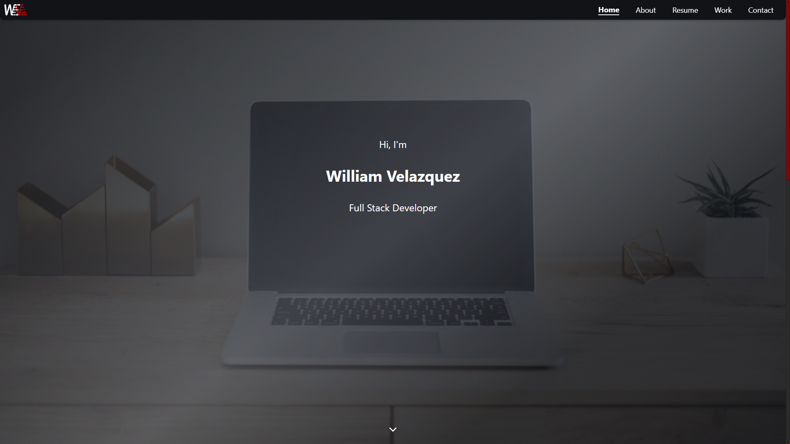
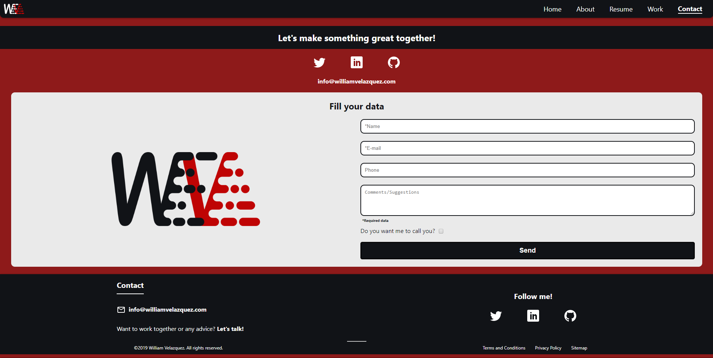

# William Velázquez Portfolio

William Velázquez Personal Portofolio developed with NextJS as a Progressive Web App

[Live Website](https://williamvelazquez.com/)

## ¿How it works?

Require Node.JS

* `npm install` For instailling dependencies.
* `npm run next:dev` For developing environment.
* `npm run build && npm next:start` For production environment.

## Author & Credits

- [William Velazquez](https://twitter.com/@WilliamVlazquez)

## Social Networks

- [Facebook]()
- [Twitter](https://twitter.com/@WilliamVlazquez)
- [Instagram]()

## Screenshots

